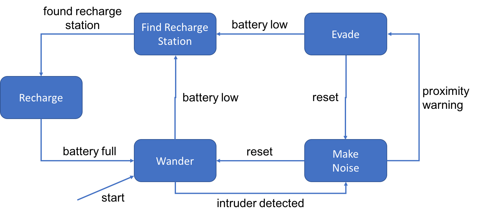

# RoboGrid
`RoboGrid` is an extension to the `Robot` finite state machine example from Week 7. It is modeled after the diagram below.

___________________
## Overview
`RoboGrid` provides the following extended functionality to `Robot`:
- Simulation of the robot as it autonomously navigates around a user-defined 2-D grid
- The 2-D grid will act as a "chessboard" and individual spaces will have an {x,y} coordinate
- The user may place "props" on the grid. These props include:
    - Recharge stations
    - Additional robots
    - Intruders
- The robot will have the ability to react to and interact with certain props
- Active logging of all robot movements, user interactions, and background computations
___________________
## Success Criteria
Included in `RoboGrid` is a test script that will initialize, run, and interact with the simulation. This test script is meant to be a full-suite test in that it will attempt to stress the simulation by:
- Adding the maximum number of props
- Performing all allowable user interactions
- Keeping the simulation running as long as possible
___________________
## Next Steps/Milestones
### Phase One: Infrastructure and Definition | Completed by March 13, 2019
- [] Implement Grid Architecture (Initialize and Display)
- [] Establish All Possible States
- [] Establish All Possible Events
- [] Update State Machine Diagram

### Phase Two: Simulation and Interaction | Completed by March 20, 2019
- [] Develop Robot Behavior at each State
- [] Develop Robot Behavior at each Event
- [] Implement Robot's Autonomy
- [] Implement User Interaction

### Phase Three: Log File and Documentation | Completed by March 21, 2019
- [] Enable Logging Feature (Write to Log File)
- [] Implement Documentation
___________________
## Down The Line
- *Future extensions may include:*
    - *3-D grid*
    - *Additional props such as immovable objects or non-intruder actors*
    - *Time-sensitive triggers*
___________________